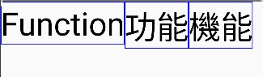

# Compose text height issue sample

This project demonstrates an issue of the Text composable.

On Android 33, height of the Text which displays Chinese characters is taller than the one displays
Latin letters:

While on pre-33, their heights are the same:

